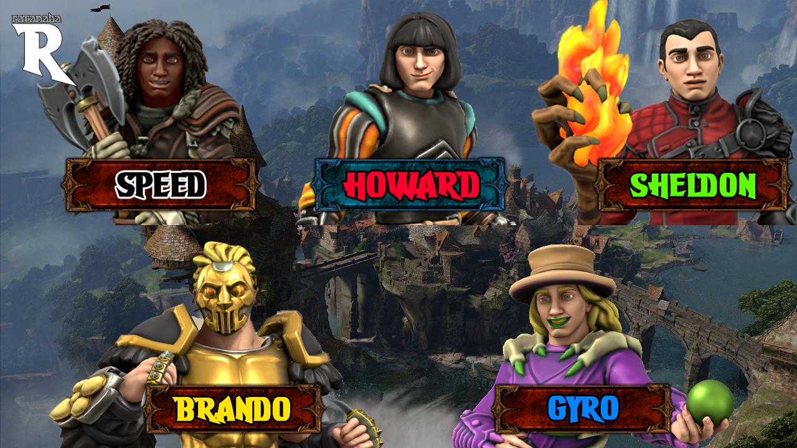

# Ratanabá Monumentus RPGText

Ratanabá Monumentus é um jogo de aventura e RPG Linear desenvolvido em C, para o trabalho final da matéria de FUP.

## Status

Funções   | Status
--------- | ------
SAVE E LOAD | COMPLETO 
LOJA | COMPLETO
HISTÓRIA | 98% DESENVOLVIMENTO
BATALHA | COMPLETO

## Imagens do Projeto

### LOGO

### BANNER

## Como posso jogar?

O Jogo é possível jogar apenas pelo Windows.

## Quem já contribuiu:

